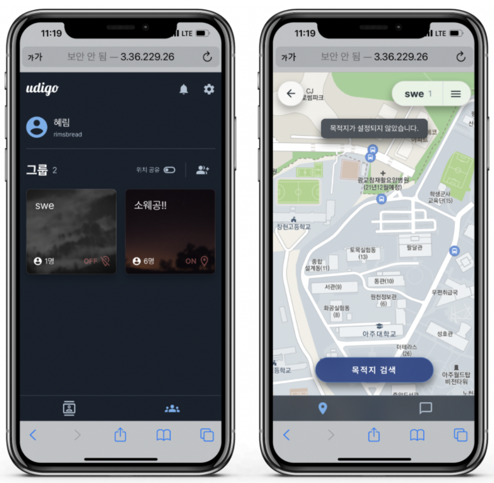
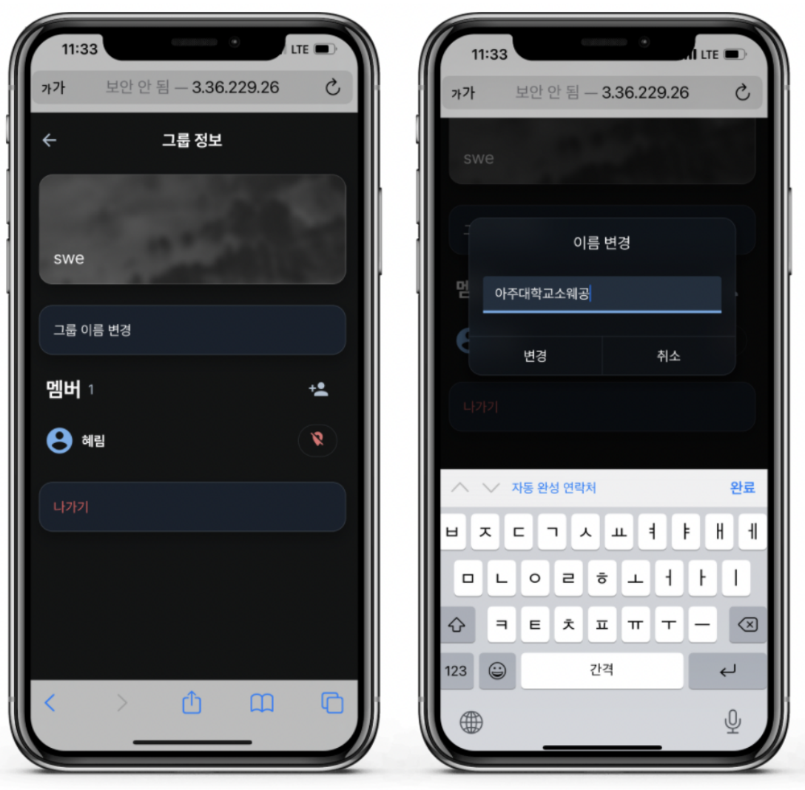

# udigo-ui

Udigo: a location-sharing social network, built as a team project for a Software Engineering course (Fall 2021). This repo is a snapshot of the frontend as of December 3 — after that, frontend work continued directly in the main [Udigo](https://github.com/canplane/Udigo) repo (private).

**[Take a look!](https://udigo-ui.netlify.app)** · **[Figma](https://www.figma.com/design/IHjkfPnOqYlpva6Lrl7QMe/udigo---2021-Fall)**

## Screenshots

 

*From the full build (backend included), not this UI-only repo.*

## Notes

- Built with vanilla JS/CSS instead of jQuery/Bootstrap this time, as a point of departure from [kpx-ui](https://github.com/canplane/kpx-ui).
- This repository contains the UI/UX prototype. The full course project also included an Express/MySQL backend with [NAVER](https://www.naver.com/) OAuth, group management, and location-sharing APIs, but that repository remains private because it is a fork of the original team repository.

## About

- **Timeline:** 2021-11-29 – 2021-12-11
- **Full implementation:** [Udigo](https://github.com/canplane/Udigo) (private)

---
[github.com/canplane/udigo-ui](https://github.com/canplane/udigo-ui)
